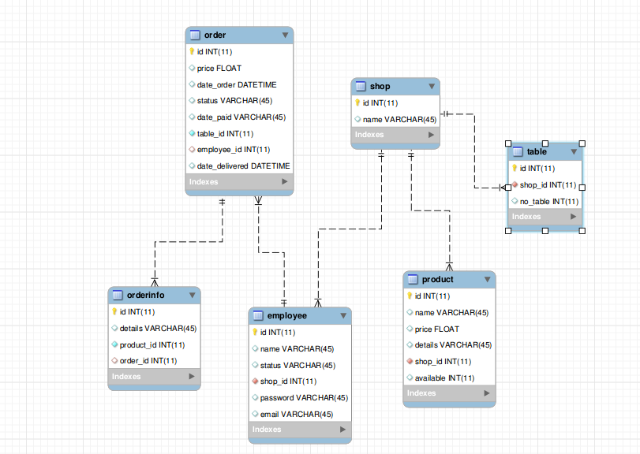

# ShopManager 
1.Installation
2.Database Schema
3.Server Api calls
4.Pdf with web application and android app

## 1.Installation

1. **Starting Server** 
    After you create a virtual enviroment 
    shopManager/server : 

```..ShopManager/server$ pip3 install -r requirements.txt``` <br>
``` ..ShopManager/server$ export FLASK_APP=main.py```<br>
```..ShopManager/server$ flask run h -0.0.0.0```


1. **Android App**
    Using ifconfig find inet addr and then add it on MainActivity.java
    Connect phone with android studio and run compiler 

## 2.Database Schema



## 3. ShopManager Server Api calls 

1. **User**
   - GET /select/userId 
   - POST /updateUser
   - POST /addUser 
   - POST /login_user
  
2. **Product**
   - GET /select_product/shopId 
   - POST /add_product
   - POST /update_product

3. **Order**
   - POST /add_order
   - POST /update_delivered_order
   - POST /update_paid_order
   - POST /select_order

4. **Shop**
   - GET /selectShop/shopId
   - POST /addShop


5. **Table** 
   - GET /select_table/{shop_id}
   - POST /add_table

## **USER**

**<font color="red">GET /select/userId**</font>

*Response*: 
```

{
    "email": <unique str>,
    "id": <unique id>,
    "name": <str>,
    "password": ********,
    "shop_id": <unique id>,
    "status": <admin/ user>
}

```


**<font color="red">POST /updateUser**</font>

*Request*: 
```
{
    "email":<str>
	"status":<admin/ user>, 
	"name": <str>, 
	"id":<unique id>
}
```

*Response*: 

On Success ```{   "success": True   }```<br>
On Error ```{   "success": False   }```

**<font color="red">POST /addUser**</font>

```
{
    "email": <unique str>,
    "id": <unique id>,
    "name": <str>,
    "password": ********,
    "shop_id": <unique id>,
    "status": <admin/ user>
}
```
*Response*: 

On Success ```{   "success": True   }```<br>
On Error ```{   "success": False   }```

**<font color="red">POST  /login_user**</font> 

```
{
    "email": <unique str>,
    "password": ********,
}
```

*Response*: 
```
    On success:
[
    {
        "email": <unique str>,
        "id": <unique id>,
        "name": <str>,
        "password": ********,
        "shop_id": <unique id>,
        "status": <admin/ user>
    }
]
```

    On Failure:  []

**<font color="red">POST  /login_mobile**</font> 

```
{
    "email": <unique str>,
    "password": ********,
}
```

*Response*: 

```
    On success:
[
    {
        "email": <unique str>,
        "id": <unique id>,
        "name": <str>,
        "password": ********,
        "shop_id": <unique id>,
        "status": <admin/ user>
    }
]
```
    On Failure: []


## **PRODUCT**
-------------------------------------------------
**<font color="red">GET /select_product/shopId**</font>

*Response*: 

```
    On success:
 [
    {
        "name":<str>,
        "price":<float>,
        "available":<int>,
        "shop_id":<unique int>,
        "details":<str>
    }
    {
        ...
    }
]
```
    On Failure:  []


**<font color="red">POST /add_product**</font>

*Request*: 
```
{
	"name":<str>,
	"price":<float>,
	"available":<int>,
	"shop_id":<unique int>,
	"details":<str>
}
```
*Response*: 

On Success ```{   "success": True   }```<br>
On Error ```{   "success": False   }```

**<font color="red">POST /update_product**</font>

*Request*: 
```
{
	"name":<str>,
	"price":<float>,
	"available":<int>,
	"shop_id":<unique int>,
	"details":<str>
}
```
*Response*: 

On Success ```{   "success": True   }```<br>
On Error ```{   "success": False   }```

## **ORDER**
-------------------------------------------------
**<font color="red">POST /add_order**</font>

*Request*: 
```
{
	"table_id":<unique int>,
	"user_id":<unique int>,
	"orderHistory":[
            {"product_id":<unique int>, "details":<str>}, 
            {"product_id":<unique int>, "details":<str>}
        ],
	"order_id":-1
} 
```

__if order_id != -1 we add item to excisting order
else we create a new order__

*Response*: 

On Success ```{   "success": True   }```<br>
On Error ```{   "success": False   }```


**<font color="red">POST /update_delivered_order**</font>

*Request*:  

``` 
{   "order_id":<unique id>  }
```

*Response*: 

On Success ```{   "success": True   }```<br>
On Error ```{   "success": False   }```


**<font color="red">POST /update_paid_order**</font>

``` 
{   "order_id":<unique id>  }
```

*Response*: 

On Success ```{   "success": True   }```<br>
On Error ```{   "success": False   }```

-------------------------------------------------

**<font color="red">POST /select_order**</font>

*Request*: 
```
{
    "shop_id":<unique id>, 
    "start_date":<date>,
    "end_date":<date>,
    "status": <admin/employee>,
    "employee": <list on names>,
    "table": <list on table>,
    "products": <list on products>
}
```

Example of requests:
```
{
	"shop_id":0, 
	"start_date":"2009-10-28",
	"end_date":"2021-10-28",
	"status":["pending", "delivered"],
    "tables":["8"],
    "employees":["0"]
}
```
*Response*: 
```
    On success
[
    {
        "date_delivered": <date>,
        "date_order": <date>,
        "date_paid": <date>,
        "employee_id": <unique id>,,
        "id": <unique id>,
        "no_table": <int>,
        "o.table_id": <int>,
        "orderHistory": [
            {
                "details": <str>,
                "name": <str>,
                "o_info": <int>,
                "order_id": <int>,
                "product_id": <int>
            },
            {
                "details": <str>,
                "name": <str>,
                "o_info": <int>,
                "order_id": <int>,
                "product_id": <int>
            }
        ],
        "price": <int>,
        "status": <delivered/paid>,
        "table_id": <int>
    },
]
```
    On Failure:  []

## **SHOP** 
-------------------------------------------------

**<font color="red">POST /addShop**</font>

*Request*:  

```
{   "name": <unique str>  }
```

*Response*: 

On Success ```{   "success": True   }```<br>
On Error ```{   "success": False   }```


**<font color="red">GET /selectShop/<shop_id>**</font>

response : 
```
{
    "id": <unique id>,
    "name": <unique str>
}
```


## **TABLE** 
-------------------------------------------------
**<font color="red">GET /show_tables/<shop_id>**</font>

*Response*
```
    On success:
[
    {
        "no_table": <int>,
        "shop_id": <unique int>,
        "table_id": <unique int>
    },
    {
        ...
    }
]
```
    On Failure:  []

**<font color="red">POST /add_table**</font>

*Request*:  

``` 
{   "shop_id":<unique id>  }
```
*Response*: 

On Success ```{   "success": True   }```<br>
On Error ```{   "success": False   }```


